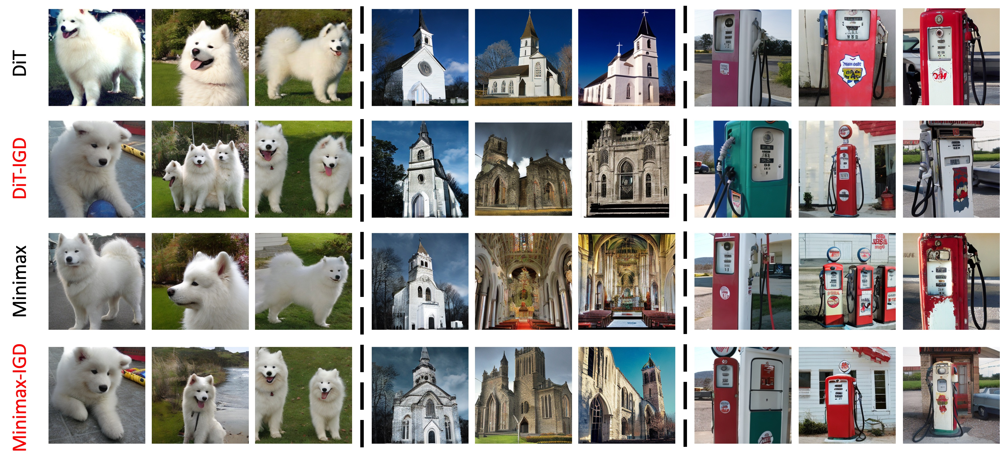
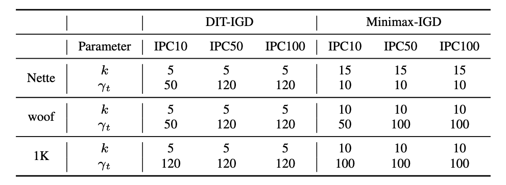

# Influence-Guided Diffusion for Dataset Distillation

This is the official implementation for the ICLR 2025 paper "[Influence-Guided Diffusion for Dataset Distillation](https://openreview.net/forum?id=0whx8MhysK)".

<div align="center">
    
</div>

## Abstract
Dataset distillation aims to streamline the training process by creating a compact yet effective dataset that retains the essential information of a much larger original dataset.

Motivated by the remarkable capabilities of **diffusion generative models in learning target dataset distributions** and controllably sampling high-quality data tailored to user needs, we propose framing dataset distillation as a controlled diffusion generation task aimed at **generating data specifically optimized for effective training**.

By establishing a correlation between the overarching objective of dataset distillation and the trajectory influence function ([TracIn](https://arxiv.org/abs/2002.08484)), we introduce the Influence-Guided Diffusion (IGD) sampling framework to generate training-effective data without the need to retrain diffusion models.

An **influence guidance** function is designed by leveraging TracIn as an indicator to steer the diffusion process toward producing data with high training impact, complemented by a **deviation guidance** function for diversity enhancement.

Extensive experiments demonstrate that our IGD method achieves state-of-the-art performance in distilling ImageNet datasets.

## Implementation
### Getting Started

First, create the Conda virtual environment:

```bash
conda env create -f environment.yaml
```

Then, activate the Conda environment:

```bash
source activate diff
```

Before starting, ensure that your ImageNet-1K dataset is located at:

```
../imagenet/
```

### Training a Surrogate Model for Influence Computation
Before running distillation, you need to train a surrogate model on the original dataset by executing:

```bash
bash train_ckpts.sh
```

This script will train a ConvNet-6 model on your target dataset (specified by "spec") for 50 epochs. The trained model will be saved in `./ckpts/`.

### Downloading Pre-Trained DiT Models

```bash
python download.py
```

### Influence-Guided Sampling with DiT

To generate an IPC50 surrogate dataset for ImageWoof using a pre-trained [DiT](https://github.com/facebookresearch/DiT) model with our IGD sampling method, run:

```bash
bash sample_mp.sh
```

To reproduce our results obtained with the [Minimax](https://github.com/vimar-gu/MinimaxDiffusion) fine-tuning approach, follow these steps:
1. Access the official Minimax repository and fine-tune a DiT model as per their instructions.
2. After obtaining the Minimax fine-tuned checkpoint, modify its path in the following script and run:
```
bash sample_mp_minimax.sh
```

### Training Models on the Generated Data for Validation

Run the following script to train a ResNetAP-10 model on the generated dataset using five random seeds:

```bash
bash train.sh
```

## Hyperparameter Setup
Use the following hyperparameters to reproduce the results reported in Tables 1 & 2 of our paper:

<div align="center">
  
</div>

## Citation
If you find our work useful for your research, please cite:

```bibtex
@inproceedings{
chen2025influenceguided,
title={Influence-Guided Diffusion for Dataset Distillation},
author={Mingyang Chen and Jiawei Du and Bo Huang and Yi Wang and Xiaobo Zhang and Wei Wang},
booktitle={The Thirteenth International Conference on Learning Representations},
year={2025}
}
```

## Acknowledgements
This project is primarily developed based on the following works:
- [DiT](https://github.com/facebookresearch/DiT)
- [MinimaxDiffusion](https://github.com/vimar-gu/MinimaxDiffusion)
- [MTT](https://github.com/GeorgeCazenavette/mtt-distillation)
- [guided-diffusion](https://github.com/openai/guided-diffusion)

