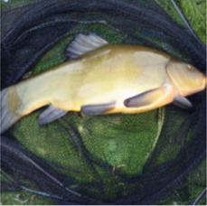
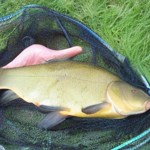
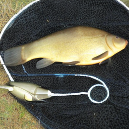
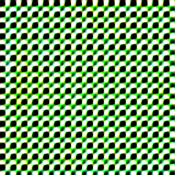

# ImageNette
baseline:

full set:

| model    | resnet10   | resnet18  | convnet6 | dinov2-base | dinov2-small | dinov2-small |
|----------|------------|-----------|----------|-------------|--------------|--------------|
| baseline | 94.6       | 95.3      | 94.3     | -           |              |              |
| results  | 83.2       | 83.2      | 82       | 84          |              |              |

**用他的代码训练的代理模型是完全不如论文里报告的full set的准确率的**

Dit-IPC10：

| train\proxy | resnet10     | resnet18   | convnet6 | dinov2-base |
|-------------|--------------|------------|----------|-------------|
| resnet10    | 60.3±0.3     |            |          |             |
| resnet18    |              | 59.9±0.4   |          |             |
| convnet6    |              |            |          |             |
| dinov2-base |              |            |          |             |

MiniMax-IGD IPC10:

| train\proxy | resnet10 | resnet18 | convnet6  |
|-------------|----------|----------|-----------|
| resnet10    | 66.2     | 66.7     | 58.9      |
| resnet18    | 66.7     | 63.1     | 62.2      |
| convnet6    | 66.5     | 67.7     | 61.9      |

RAEIGD-IPC10:

| train\proxy  | resnet10 | resnet18 | convnet6 | dinov2-base |
|--------------|----------|----------|----------|-------------|
| resnet10     | 68.1     |          |          |             |
| resnet18     |          | 67.3     |          |             |
| convnet6     |          |          |          |             |
| dinov2-base  |          |          |          |             |

# cifar
baseline:

MiniMax-IPC10: 

| 模型       | resnet10 | resnet18 |
|----------|----------|----------|
| resnet10 | 81.5%    | 81.3%    |
| resnet18 |          | 82.5%    |

# 问题
1. 代理模型本身准确率就不太行，论文里的准确率可能是专门做分类的sota结果，感觉可以找一下他们的训练代码。
2. minimax、RAE的质量都很模糊、没什么细节。不会要512的吧。

原图：

论文：

Minimax：

RAE:

3. MiniMax直接在imagenet上训练会直接崩坏

